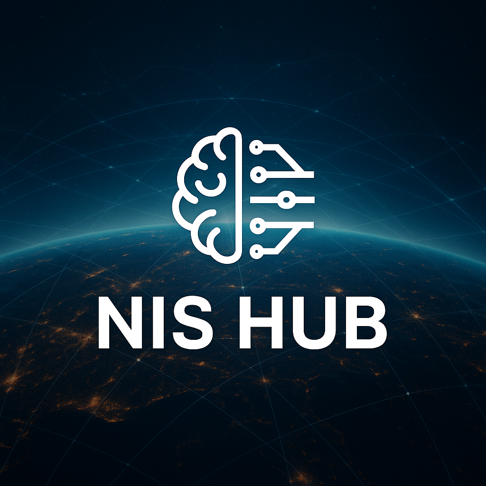

# 🧠 NIS HUB – Central Intelligence for Neuro-Inspired AI Systems

<div align="center">
  
</div>

**NIS HUB is the core coordination system that unifies all distributed deployments of the NIS Protocol** — a neuro-inspired architecture for cognitive AI agents. Acting as the central nervous system, the NIS HUB connects autonomous subsystems such as:

- 🛰️ **NIS-X** (Exoplanetary AI)
- 🚁 **NIS Drone** (Autonomous UAV Systems)
- 🧭 **NIS Archaeological Research** (Cultural Heritage AI)
- 🌩️ **NIS Weather Intelligence** (Climate Analysis)
- 🤖 **Future modular agents and systems**

This platform provides real-time memory synchronization, agent registry, mission orchestration, and centralized reasoning — enabling NIS agents across domains to communicate, evolve, and act as a collective intelligence.

## 🔧 Key Features

- **FastAPI Backend** - Secure node registration, memory sync, and agent communication
- **React Dashboard** - Visualizing system health, mission states, and active reasoning
- **Modular SDK** - Plug in any NIS-based project seamlessly
- **Central Supervisor Agent** - BitNet/GPT-based coordination of multi-agent cognition
- **Federated Memory Fusion** - Redis + optional vector store for shared intelligence
- **Audit & Integrity Logging** - Ensuring verifiable AI behavior at scale

## 🌐 Why It Matters

The NIS HUB enables planetary-scale intelligence coordination by bridging agents that operate in vastly different domains — from space to Earth, from memory to action. It's the backbone for deploying decentralized, self-aware, and transparent AI systems at scale.

## 🚀 Quick Start

### Prerequisites
```bash
# Python 3.9+
python --version

# Node.js 18+
node --version

# Redis Server
redis-server --version
```

### 1. Install Dependencies
```bash
# Backend dependencies
pip install -r core/requirements.txt

# Frontend dependencies
cd ui && npm install
```

### 2. Start Core Services
```bash
# Start Redis
redis-server

# Start NIS HUB Core
cd core && python main.py

# Start Dashboard (separate terminal)
cd ui && npm start
```

### 3. Register Your First Node
```python
from nis_hub_sdk import NISNode

# Connect your NIS project to the HUB
node = NISNode(
    name="NIS-X-Exoplanet",
    type="atmospheric_analysis",
    endpoint="http://localhost:8001"
)

node.register()
node.start_heartbeat()
```

## 🏗️ Architecture

```
                    ┌─────────────────┐
                    │   NIS HUB CORE  │
                    │   (FastAPI)     │
                    └─────────┬───────┘
                              │
             ┌────────────────┼────────────────┐
             │                │                │
    ┌────────▼────────┐ ┌─────▼─────┐ ┌───────▼───────┐
    │  Agent Registry │ │  Memory   │ │  Supervisor   │
    │  & Health Mon.  │ │   Layer   │ │    Agent      │
    └─────────────────┘ └───────────┘ └───────────────┘
             │                │                │
    ┌────────▼────────────────▼────────────────▼────────┐
    │              Gateway API Layer                    │
    │          (REST + WebSocket)                       │
    └─────┬─────────┬─────────┬─────────┬─────────┬─────┘
          │         │         │         │         │
      ┌───▼───┐ ┌───▼───┐ ┌───▼───┐ ┌───▼───┐ ┌───▼───┐
      │NIS-X  │ │ Drone │ │ Arch  │ │Weather│ │Future │
      │Planet │ │       │ │       │ │       │ │ Nodes │
      └───────┘ └───────┘ └───────┘ └───────┘ └───────┘
```

## 📁 Project Structure

```
nis-hub/
├── core/              # FastAPI backend
│   ├── main.py        # API server entry point
│   ├── routes/        # API endpoints
│   ├── models/        # Data models
│   └── services/      # Business logic
├── ui/                # React dashboard
│   ├── src/           # React components
│   ├── public/        # Static assets
│   └── package.json   # Frontend dependencies
├── sdk/               # Python SDK for nodes
│   ├── nis_hub_sdk/   # SDK package
│   └── examples/      # Usage examples
├── agents/            # Supervisor agent system
│   ├── supervisor.py  # Main coordinator agent
│   └── reasoning/     # Multi-agent reasoning logic
├── tests/             # Test suite
│   ├── unit/          # Unit tests
│   ├── integration/   # Integration tests
│   └── simulators/    # Node simulators
├── docs/              # Documentation
├── scripts/           # Deployment & automation
├── data/              # Shared memory cache
└── logs/              # System logs
```

## 🔌 API Endpoints

### Core Registration
- `POST /api/v1/nodes/register` - Register a new NIS node
- `POST /api/v1/nodes/heartbeat` - Send heartbeat signal
- `GET /api/v1/nodes/status` - Get all node statuses

### Memory Synchronization
- `POST /api/v1/memory/sync` - Sync memory with HUB
- `GET /api/v1/memory/fetch` - Retrieve shared memories
- `POST /api/v1/memory/broadcast` - Broadcast to all nodes

### Mission Coordination
- `POST /api/v1/missions/create` - Create coordinated mission
- `GET /api/v1/missions/status` - Get mission status
- `POST /api/v1/missions/update` - Update mission progress

## 🧠 Supervisor Agent

The BitNet-powered supervisor agent provides high-level coordination:

```python
# Example: Cross-domain reasoning
supervisor.analyze_correlation(
    source_domain="exoplanet_atmospheres",  # From NIS-X
    target_domain="weather_patterns",      # To NIS-Weather
    context="atmospheric_chemistry"
)

# Results in intelligent routing of insights
```

## 🔒 Security & Authentication

- **Node Authentication** - JWT-based secure communication
- **Memory Encryption** - End-to-end encrypted memory sync
- **Audit Logging** - Complete action tracking
- **Rate Limiting** - Protection against abuse

## 🧪 Testing

```bash
# Run all tests
python -m pytest tests/

# Test with node simulators
python tests/simulators/run_simulation.py

# Integration test with multiple domains
python tests/integration/test_cross_domain.py
```

## 📚 Documentation

- [Quick Start Guide](docs/quick-start.md)
- [SDK Reference](docs/sdk-reference.md)
- [API Documentation](docs/api-reference.md)
- [Supervisor Agent Guide](docs/supervisor-agent.md)
- [Deployment Guide](docs/deployment.md)

## 🌟 Example Use Cases

1. **Cross-Domain Intelligence** - NIS-X exoplanet findings inform NIS-Weather climate models
2. **Coordinated Missions** - NIS Drone + NIS Archaeological surveys working in tandem
3. **Shared Memory Pool** - All agents contributing to collective knowledge base
4. **Emergency Coordination** - Rapid response across all active NIS systems

## 🛠️ Development

### Adding New Endpoints
```python
# core/routes/custom_endpoint.py
from fastapi import APIRouter

router = APIRouter()

@router.post("/api/v1/custom/endpoint")
async def custom_function():
    return {"status": "success"}
```

### Creating Node Simulators
```python
# tests/simulators/my_node_sim.py
from nis_hub_sdk import NISNode

class MyNodeSimulator(NISNode):
    def generate_test_data(self):
        # Simulate your node's behavior
        pass
```

## 🤝 Contributing

1. Fork the repository
2. Create your feature branch (`git checkout -b feature/amazing-feature`)
3. Commit your changes (`git commit -m 'Add amazing feature'`)
4. Push to the branch (`git push origin feature/amazing-feature`)
5. Open a Pull Request

## 📄 License

This project is licensed under the MIT License - see the [LICENSE](LICENSE) file for details.

## 🔗 Related Projects

- [NIS Protocol](https://github.com/Organica-Ai-Solutions/NIS_Protocol) - Core framework
- [ArielChallenge](https://github.com/Organica-Ai-Solutions/ArielChallenge) - NIS-X implementation

## 📧 Contact

**Organica AI Solutions**
- Repository: [NIS-HUB](https://github.com/Organica-Ai-Solutions/NIS-HUB)
- Issues: [GitHub Issues](https://github.com/Organica-Ai-Solutions/NIS-HUB/issues)

---

🚀 **Ready to coordinate planetary-scale AI intelligence!** ⭐ Star this repository if you find it useful! 